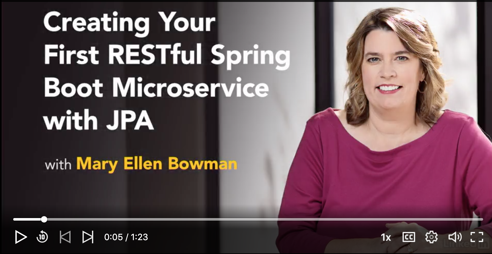
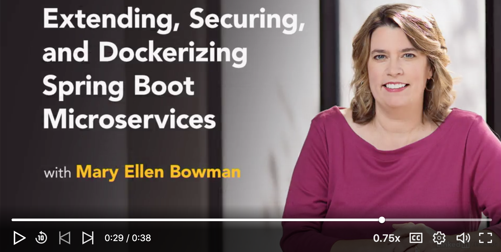
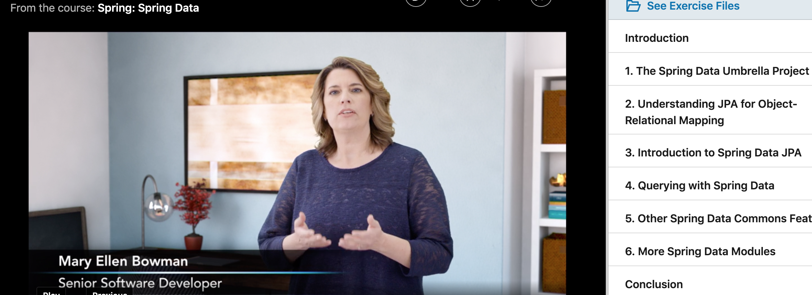
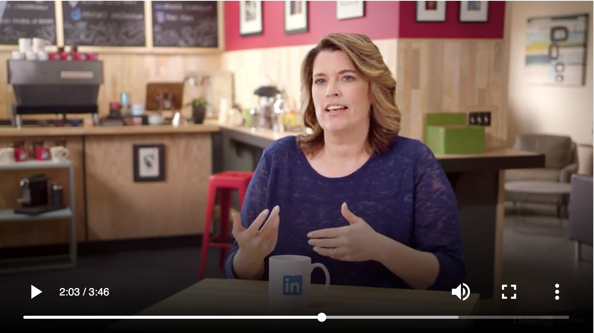

### Mary Ellen Teaches...Java Software Development.
##### [{:height="50px" width="1500px"}](https://linkedin-learning.pxf.io/KGnQz)
#### [{:height="100px" width="200px"}   Become A Spring Developer](https://linkedin-learning.pxf.io/1kmKB)
Spring is a popular and fast-growing application framework and inversion-of-control (IOC) container for the Java platform. Learn how to get started with Spring using Spring Boot to build dynamic, data-driven applications. [Course List](https://linkedin-learning.pxf.io/1kmKB).
#### [{:height="100px" width="200px"}   Creating Your First RESTful Spring Boot Microservice with JPA](https://linkedin-learning.pxf.io/Wz1Pn)
Turbocharge your back-end Java RESTful API development with Spring Boot and Spring Data technologies. This course is intended for experienced Java developers who want to rapidly build microservices that connect with relational databases via the Java Persistence API (JPA). [Watch now for free](https://linkedin-learning.pxf.io/Wz1Pn) (with LinkedIn Learning 30 day trial).
#### [{:height="100px" width="200px"}   Extending, Securing and Dockerizing Spring Boot Microservices ](https://linkedin-learning.pxf.io/3aGqA)
Learn how to extend, refine, harden, test, and "dockerize" your Spring Boot microservices, and turn them into production-ready applications. [Watch now for free](https://linkedin-learning.pxf.io/3aGqA) (with LinkedIn Learning 30 day trial).
#### [{:height="100px" width="200px"}   Spring:Spring Data](https://linkedin-learning.pxf.io/dvmPy)
Coding to databases—which often involves the use of boilerplate code that's difficult to maintain and debug—can be tedious work. Spring Data addresses these issues by abstracting data store interactions into a common repository API and eliminating boilerplate code. [Watch now for free](https://linkedin-learning.pxf.io/dvmPy) (with LinkedIn Learning 30 day trial).

## [{:height="100px" width="100px"}](https://maryellenteaches.github.io/action.png)   About Mary Ellen 
Mary Ellen Bowman is a Software Development Instructor and Author who has over 25 years of full lifecycle software development experience in various industries including healthcare, aerospace, supply chain management, logistics, and government contracting. Recent experience in Web-Enablement using Spring (Data JPA, Boot, REST), AWS Ecosystem (Lambda, Dynamo, SQS), and Docker containers.
Specialties: Java, Spring Data JPA and MongoDb, Spring Boot, Docker, RESTful WebServices, AWS Lambda, DynamoDb, Agile Software Development, Javascript, JSON, Tomcat, UML, Webservices, Servlets, software development, mentoring, formal instruction. 

<a href="https://twitter.com/MEllenBowman?ref_src=twsrc%5Etfw" class="twitter-follow-button" data-show-count="false">Follow @MEllenBowman</a>

<a class="LI-simple-link" href='https://www.linkedin.com/in/mebowman?trk=profile-badge'>Mary Ellen Bowman</a>

### Live Interviews @ LinkedIn Learning Studios

#### Career Clinic: Developer Insights - Mary Ellen Bowman

[{:height="200px" width="400px"}](https://linkedin-learning.pxf.io/MV9vN)

#### Career Clinic: Developer Insights - Favorite gadgets/tech (featured)

[{:height="200px" width="400px"}](https://linkedin-learning.pxf.io/QX5Zo)

